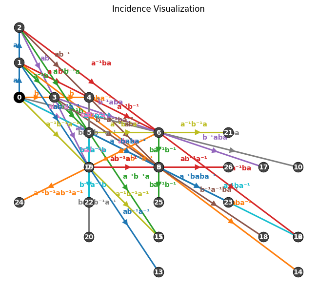

\

# Lincidence:
## Algorithmic Generation of Free Linear Spaces and Combinatorial Structures in Incidence Geometry
(**Linear** Spaces + **Incidence** Geometry)\
\
Python tools to construct and visualize abstract linear spaces, implement algorithms to iteratively generate incidence structures, test geometric axioms, and explore group-theoretic, combinatorial, graph-theoretic, and computational connections.\
\
View the code at [Lincidence_Refined.ipynb](Lincidence_Refined.ipynb), which contains the source as well as several examples. For the writeup containing an explanation and the mathematical backings of the proof, please visit [Lincidence_Writeup.pdf](Lincidence_Writeup.pdf).\
\
This was a project to explore free linear spaces and develop tools to aid in their mathematical generation. More information is being added to the writeup (including more rigor to the mathematical proof), and more Python tools are being build to expand on the current functionality! Enjoy!

